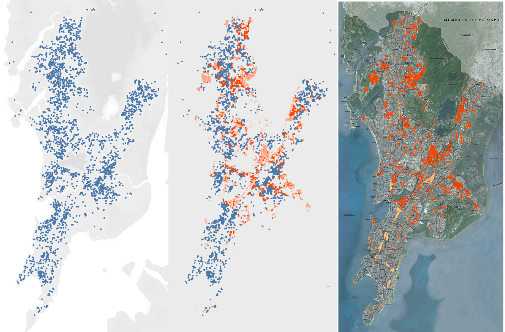

# Final Report

## Executive Summary
The _Real Estate Data and Satellite Imagery for Slum Identification project_ takes satellite imagery from Google Maps, public overlay images mapping known slum areas, and web-scraped real estate listings to find the bounds of slums and/or areas where informal housing are predominate. The outputs from the machine learning classification and modeling will help New Light Technologies facilitate:
* Preparation for emergencies affecting slum areas
* Increase response time to emergencies by identification of slum areas

### Assumptions
The usage of online satellite image data, locality-subjective slum designation, and real estate listings will combine to successfully define a slum area. This may only reach the first operational definition of a slum as recently recommended by a United Nations Expert Group Meeting (EGM):
- Overcrowding/Hyperdensity.
- Insecure residential status.
- Inadequate access to safe water.
- Inadequate access to sanitation and other public-works infrastructure.
- Poor structural quality of housing.

# Modeling
## Real Estate Data
### Choosing cities
Cities Chennai, Hyderabad, Mumbai, New Delhi, India, and Rio de Janeiro, Brazil are the subject areas for this project endeavor.

### Scraping Real Estate Data
Web scraping of real estate data was performed using the [Selenium](https://www.selenium.dev) web driver for the Google Chrome web browser. To protect against automated, script-based blocking of page access, the user agent string (UA) was rotated by client-side scripting. Fetched pages were serialized to disk for follow-on processing using the [Beautiful Soup](https://www.crummy.com/software/BeautifulSoup/bs4/doc/) Python library.

### Example Real Estate Listing

### Exploratory Data Analysis (EDA)
Analysis of the data assembled from souped real estate HTML follows these rules-of-thumb:
* Unnecessary property attributes are dropped from the dataframe. E.g. "Tenets Preferred".
* Rental amounts are parsed out and cast into the correct data type and precision.
    * (Optional) Rental amounts are converted to USD equivalent within the dataframe.
* Latitude and longitude for the property are filled-in with address lookup values to a location webservices API if missing in the dataframe.
    * Both the [geopy](https://geopy.readthedocs.io/en/stable/) and the [googlemaps](https://github.com/googlemaps/google-maps-services-python) Python clients were used to complete latlong values for project dataframes.  

### Utilizing Existing Slum Maps
Most publically available maps of slums do not include coordinate data. To provide a classification on our real estate data we had to translate the pixel coordinates to latitude and longitude. This was accomplished by taking two reference points at the **origin** and the **edge** of the maps coordinates. The reference points were used to provide conversion factors between pixel distance and real world distance. Finally, a function was developed taking the input latitude and longitude conversion factors and output a boolean representing whether or not the location is in a slum.

### Using Slum Maps Demo

## Satellite Data
### Choosing Which Satellite Imagery Service to Use
Many satellite imagery APIs were considered for the data aquisition, however high resolution satellite data is not available for free on these services. Ultimately, screenshots of [Google Earth](https://earth.google.com/) were used.

### Labeling Satellite Data
The slum maps that were used in the real estate data were also used to guide image labelling. Labelling was done manually and simultaneous to data collection.

### Processing Images for Classification
Images were scaled to uniform size and then split into 400 equal parts.

## Image Classification
Images were classifed using [Keras](https://keras.io)' [MobileNetV2](https://keras.io/applications/#mobilenetv2) implementation.

### Example Non Slum Image

### Example Slum Image

# Running Our Models

## Image Classifier
1. Place images in directory `satellite_imagery/place_images_here/`.
2. Run `satellite_imagery/image_preproccesor.py`.
3. Run `satellite_imagery/image_classifier.py`.

## Real Estate Data Classifier
1. Run `real_estate_listings/modeling/combined5cities.ipynb`
    - Performs bootstrapping on the five selected cities.
    - Performs on train, test split and the RandomForestClassifier with 15 estimators.
    - Returns classifier predictions.
2. Run `real_estate_listings/modeling/x-city modeling 3cities.ipynb`
    - Performs bootstrapping on three (Rio, Mumbai, Hyderbad) of five selected cities.
    - Performs on train, test split and the RandomForestClassifier with 10 estimators.
    - Returns classifier predictions.
3. Run `real_estate_listings/modeling/x-city modeling take 1.ipynb`
    - Identical to x-city modeling 3cities.ipynb, above.
4. Run `real_estate_listings/modeling/xcity 5cities.ipynb`
    - Identical to real_estate_listings/modeling/combined5cities.ipynb, above.
5. Run `real_estate_listings/classifying/city_cost_conversion.ipynb`
    - Plot (1) histogram for rent prices between the five selected cities in log(price).
    - Plot (2) histogram for rent index between the five selected cities in log(price * rent index).
    - Plot (3) histogram for rent prices between the five selected cities in USD equivalent.
6. Run `/real_estate_listings/classifying/classifyingCD.ipynb`
    - Serializes comma-separated-values (CSV) slum classification dataset by latlong for a supplied city.
7. Run `real_estate_listings/classifying/classifyingRMH.ipynb`
    - Identical to classifyingCD.ipynb, above. 