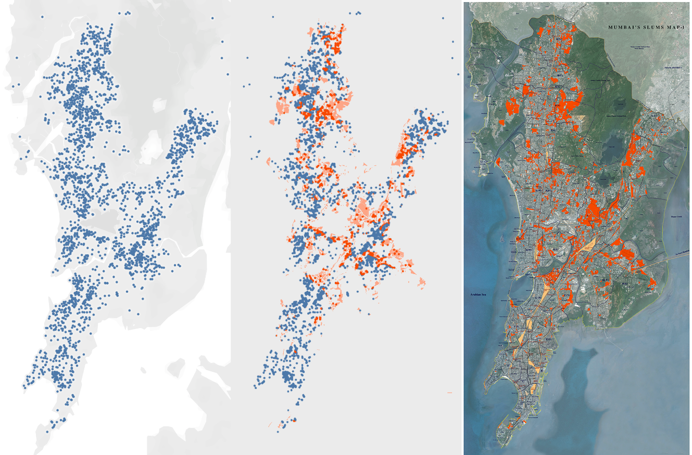

# Using Real Estate Data and Satellite Imagery to Identify Slums
This project takes satellite imagery from Google Maps, public overlay images mapping known slum areas, and web-scraped real estate listings to find the bounds of slums and/or areas where informal housing are predominate. Cities Chennai, Hyderabad, Mumbai, New Delhi, India, and Rio de Janeiro, Brazil are the subject areas for this project endeavor.

## Table of Contents

[1.0 Directory Structure](#10-Directory-Structure)

[2.0 Project Outline / Problem Statement](#20-Project-Outline)

[3.0 Description of Data](#30-Description-of-Data)

- [3.1 Sizing](##31-Sizing)
- [3.2 Sources](##32-Sources)
- [3.3 Example Real Estate listing](##33-Source-Example)
- [3.4 Data Dictionaries](##34-Data-Dictionaries)

[4.0 Images](#40-Images)

[5.0 Conclusion](#50-Conclusion)

- [5.1 Next Steps](#51-Next-Steps)

[6.0 Outside Sources](#60-Outside-Sources)

## 1.0 Directory Structure

```
.
├── images
├── real_estate_listings
├── satellite_imagery
├── Final_Report.md
└── README.md
```
## Directory Outline

For more details on the files within the directories, there is a `README.md` file within each subdirectory.

* *[images](images)*

  > A directory for reference images belonging to this project.  

* *[real_estate_listings](real_estate_listings)*

  > A directory for Jupyter Notebooks supporting the workflow from real estate (RE) data web scraping to slum modeling and classification. This directory also holds initial, enriched, and final/complete datasources as comma-separated-value (CSV) files as input/output from the workflow.

* *[satellite_imagery](satellite_imagery)*

  > A directory for satellite image files, Jupyter Notebooks, and Python scripts supporting the image classifier for slum identification.

* *[Final_Report.md](Final_Report.md)*

  > A technical summary of the project. Includes the main text of the `README.md` files in the notebook directories.

* *README.md*

  > You're looking at it.

## 2.0 Project Outline
The identification and mapping of slums, or mapping informal settlements, can be assisted by machine-learning models. Taking in historical and near-time online real estate data can assist persons by discovering the up-to-date bounds of a slum within the locality. The actions for the pre-classification workflow are independent:
- Webscraping real estate (RE) listings.
- Translation of known slum map images from pixel (x, y) to latitude and longitude coordinates.
- Labeling, scaling, and splitting of satellite images.

Requirements prior-to running the image to slum classification workflow :
- Satellite images are run through the image preprocessor.
    - The image must be located in a defined directory.
- Satellite images are run through the image classifier.
- Known slum area images are manually processed to greyscale and staged in a defined directory.
- Webscraped RE data are cleaned, processed, and staged.
    - Data features `latitude` and `longitude` are a minimal requirement.
- Real estate classifier `is_slum.py` is updated with city/location properties. 

Slum classification:
- Create or open a Jupyter Notebook.
- Import the `is_slum.py` and invoke the classifier on a selected city for the row-level `latitude` and `longitude` properties.
- (Optional) Serialize the city classification dataset.

Model:
- Create or iterate upon the Jupter Notebook with classifier model. Create and assess slum predictions for the RE data.

**Training the model on four cities and testing on the fifth:**<br><br>


**[Rent index factor](https://www.numbeo.com/cost-of-living/rankings_current.jsp) by selected city:**<br><br>


## 3.0 Description of Data

### 3.1 Sizing
Data size is dependent on the overall availability of online Real Estate data to web scraping, enrichment of same data, and overall satellite image availability for the selected city/region.

### 3.2 Sources
1. Real Estate data via [ZAPIMOVEIS - Rio de Janeiro - BR](http://bit.ly/37ovyXb)
2. Real Estate data via [magicbricks - Chennai - IN](https://www.magicbricks.com/property-for-sale-rent-in-Chennai/residential-real-estate-Chennai)
3. Real Estate data via [magicbricks - Hyderabad - IN](https://www.magicbricks.com/property-for-sale-rent-in-Hyderabad/residential-real-estate-Hyderabad)
4. Real Estate data via [99acres.com - Mumbai - IN](https://99acres.com)
5. Real Estate data via [housing.com - Mumbai - IN](https://housing.com/in/buy/mumbai/mumbai)
6. Real Estate data via [magicbricks - New Delhi - IN](https://www.magicbricks.com/property-for-sale-rent-in-New-Delhi/residential-real-estate-New-Delhi)
7. Satellite data via [Google Earth](https://earth.google.com/web/)
8. Chennai slum map via [Census India](http://censusindia.gov.in/maps/Town_maps/chennai_mun_cor_per_slum_pop.aspx)
9. Hyderabad slum map via [This Is Not An Atlas](https://notanatlas.org/maps/a-civic-mapping-project-in-an-indian-megacity/)
10. Mumbai slum map via [pkas.com (PDF)](http://www.pkdas.com/maps/3-Mumbai's-Slums-Map.pdf)
11. New Delhi slum map via [researchgate.com](https://www.researchgate.net/figure/NCT-Delhi-percentage-of-slum-population-to-total-population-According-to-the-Census-of_fig1_281845188)
12. Rio de Janeiro slum map via [London School of Economics and Political Science](https://lsecities.net)


### 3.3 Source Example


### 3.4 Data Dictionaries
ZAPMOVEIS webscrape data

| Column         | Data Type | Scraped from Site? | Desc                                                        | Notes                                                          |
| -------------- | :-------: | :----------------: | ----------------------------------------------------------- | -------------------------------------------------------------- |
| address        |    obj    |         Y          | Street and neighborhood in Rio de Janeiro.                  |                                                                |
| areas          |    obj    |         Y          | Household size.                                             | Presented in square meters (m^2).                              |
| bathrooms      |   float   |         Y          | # Baths.                                                    |                                                                |
| bedrooms       |   float   |         Y          | # Beds.                                                     |                                                                |
| parking-spaces |   float   |         Y          | # Parking Spaces.                                           |                                                                |
| zap_price_pmo  |    obj    |         N          | Brazilian reals per month rent, formatted.                  | Previously the `price` column.                                 |
| zap_price_cls  |    obj    |         N          | Brazilan reals for housing class (e.g. condominio).         | Previously the `price-item-0` column.                          |
| zap_price_iptu |    obj    |         N          | Brazilian reals excise tax / "IPTU".                        | Previously the `price-item-0` column.                          |
| latitude       |   float   |         N          | Geoloc: latitude.                                           | Latitude geocode from webservices API on address.  |
| longitude      |   float   |         N          | Geoloc: longitude.                                          | Longitude geocode from webservices API on address. |
| street         |    obj    |         N          | Split of address, first part.                               |                                                                |
| neighborhood   |    obj    |         N          | Split of address, 2nd part.                                 |                                                                |
| r$_pmo         |   float   |         N          | Brazilian reals per mo value extracted from `price` column. |                                                                |
| usd_pmo        |   float   |         N          | Calculated USD per mo value from `r$_pmo` column.           | Converted from Brazilian real to USD at R$ 100 == USD 23.24.   |

magicbricks webscrape data

| Column            | Data Type | Scraped from Site? | Desc                                               | Notes                                                                        |
| ----------------- | :-------: | :----------------: | -------------------------------------------------- | ---------------------------------------------------------------------------- |
| price             |    obj    |         Y          | INR per month rent, formatted.                     | May include Lahk ("Lac") designation for proportion of 100_000 INR.          |
| title             |    obj    |         Y          | BHK property in *location* *nbr sqft*              |  BHK is 'Bedroom\|Hall\|Kitchen' classification.                             |
| furnishing        |    obj    |         Y          | Values: Unfurnished\|Semi-Furnished\|Furnished     |                                                                              |
| tenants preferred |    obj    |         Y          | Values: Bachelors\|Family\| Bachelors/Family       |                                                                              |
| bathrooms         |   float   |         Y          | # Baths                                            |                                                                              |
| availability      |    obj    |         Y          | Availability of the property for rent              | 'Immediate' or a relative near-future date.                                  |
| latitude          |   float   |         Y          | Geoloc: latitude                                   | Geocode from webservices API on title, address when unavailable. |
| longitude         |   float   |         Y          | Geoloc: longitude                                  | Geocode from webservices API on title, address when unavailable. |
| balcony           |   float   |         Y          | # Balconies                                        |                                                                              |
| floor             |    obj    |         Y          | Property layout includes x of y floors.            |                                                                              |
| facing            |    obj    |         Y          | Property facing direction.                         |                                                                              |
| overlooking       |    obj    |         Y          | Property overlooks/has access to feature.          |                                                                              |
| car parking       |    obj    |         Y          | Parking for Property tenent.                       |                                                                              |
| owner resides     |    obj    |         Y          | Property owner on/off property.                    |                                                                              |
| curr_mark         |    obj    |         N          | Extracted currency marker from `price` column.     | Symbol for INR, Unicode: U+20B9.                                             |
| hasLac            |    obj    |         N          | Flag indicating 'Lac' used in the `price` column.  | If found, then rent will be 100_000 x price value.                           |
| inr_pmo           |   float   |         N          | INR per mo value extracted from `price` column.    |                                                                              |
| usd_pmo           |   float   |         N          | Calculated USD per mo value from `inr_pmo` column. | Converted from INR to USD at INR 100 == USD 1.4022.                          |

## 4.0 Images


## 5.0 Conclusion
* Slums are identifiable from real estate data within a city using our models, but those models do not generalize to other cities.
* Slums can be identified from satellite imagery.

### 5.1 Next Steps
* Try classifying slums in other cities with satellite imagery.
* Look at other sources of data for slum identification.


## 6.0 Outside Sources
**Articles**
 - [DIY Cartographers Are Putting Slums on the Literal Map](https://www.smithsonianmag.com/science-nature/diy-cartographers-are-putting-slums-literal-map-180958485/)
- [Slumscapes - Nairobi | Mumbai | Cape Town | Karachi | Mexico City](http://www.thisisplace.org/shorthand/slumscapes/)
- [The Borgan Project / global-poverty](https://borgenproject.org/global-poverty/)
- [Worldbank.org - Poverty and Shared Prosperity / Piecing Together the Poverty Puzzle](https://www.worldbank.org/en/publication/poverty-and-shared-prosperity)
- [Drone-mapping slums for land titling - one pixel at a time](https://factordaily.com/orissa-drone-mapped-slum-titling-project/)
- [radicalcartography.net](http://www.radicalcartography.net/index.html)
- [After the Map - Cartography, Navigation, and the  
Transformation of Territory in the Twentieth Century](http://www.afterthemap.info/index.html)
- [10 Outrageous Slums in Unexpected Places](https://listverse.com/2014/08/06/10-outrageous-slums-in-unexpected-places/)
- [OpenStreetMap - Missing Maps Project](https://wiki.openstreetmap.org/wiki/Missing_Maps_Project)
- [SlumMapping - Geo-Spacial mapping of health services in slums](http://blogs.cim.warwick.ac.uk/slummapping/readings-and-materials/)
 - [How a 1935 Minneapolis map describes the lines between zones and race/ethnicity/status](https://lawprofessors.typepad.com/property/2011/02/teaching-zoning-soon.html)
    > These policy decisions still haunt us today, and are at the root of our opportunity gap. As I have said so many times, we cannot move beyond our problems unless we are living together. 
    >
    > Think our city has been desegregated? I beg to differ. What has changed since 1935 when we literally zoned by race? If you are unable to read the small type, North Minneapolis is marked as "Negro Section," NE is marked "Foreign Born," Southwest is marked "Gold Coast," SE is marked "Middle Class." - [Jacob Frey, Council Member, c. July 2014](http://www.citypages.com/news/check-out-this-super-racist-minneapolis-map-from-1935-image-6553416)
- [Minneapolis Public Radio - Effects of Housing Discrimination Still Felt Today](https://www.mprnews.org/episode/2019/08/12/davis-effects-of-housing-discrimination-still-felt-today)
- [Mapping diversity: stats sa / South Africa](http://www.statssa.gov.za/?p=7678)
	> The Census Bureau in the United States applied the same index to Census 2000 data, listing Detroit as the most racially segregated city in that country, with a segregation index of 0,483. Even though South Africa’s largest cities have become more integrated since segregation laws were repealed in 1991 – as shown in Stats SA’s report – we still have a long way to go.
